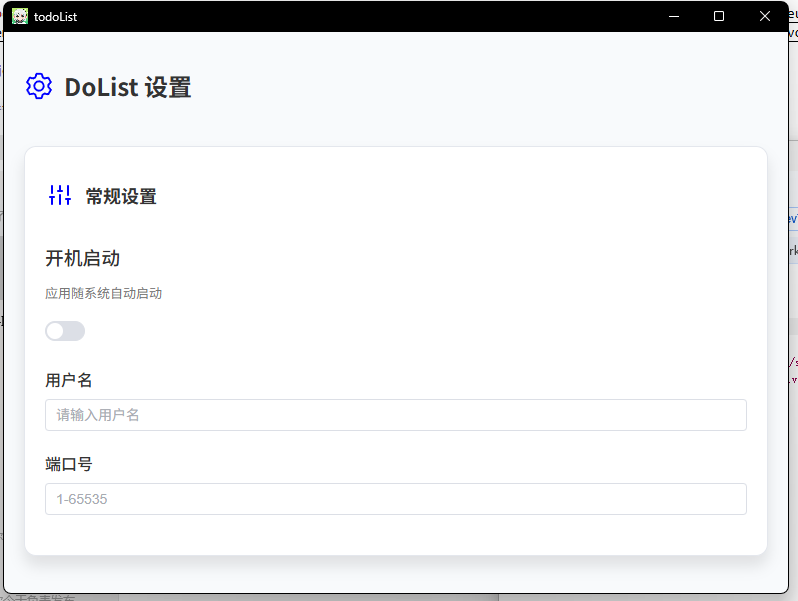
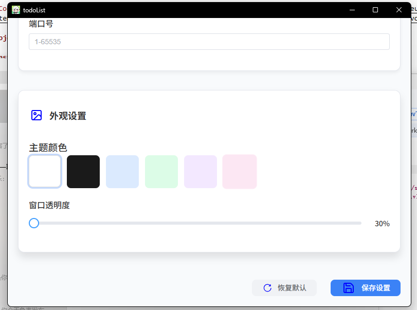

# todoList

一个todoList清单，用于提醒自己每天需要做什么

**当前功能：**

- 可设置重启后自动启动
- 记录代办的内容，重启后不会消失
- 其余设置功能暂不可用
- 透明度设置
- 加入历史记录

**下一步计划：**


- 大小调整
- 加入日期预警
- 加入预警选项和对应截止日期

## 演示

- 首页


- 设置





## Recommended IDE Setup

- [VSCode](https://code.visualstudio.com/) + [ESLint](https://marketplace.visualstudio.com/items?itemName=dbaeumer.vscode-eslint) + [Prettier](https://marketplace.visualstudio.com/items?itemName=esbenp.prettier-vscode) + [Volar](https://marketplace.visualstudio.com/items?itemName=Vue.volar)

## Project Setup

### Install

```bash
$ yarn
```

### Development

```bash
$ yarn dev
```

### Build

```bash
# For windows
$ yarn build:win

# For macOS
$ yarn build:mac

# For Linux
$ yarn build:linux
```
